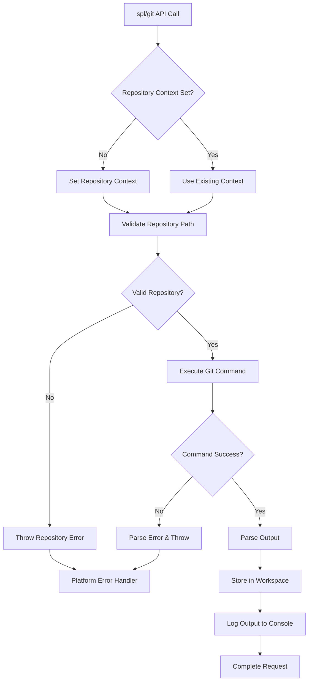

# SPL/Git API Design Plan

## Overview

The `spl/git` API is a wrapper around git commands that follows the established SPL module pattern. It provides essential git operations while integrating seamlessly with the SPL platform's execution, error handling, and workspace systems.

## API Structure

The `spl/git` API follows the established SPL pattern with these components:

```
modules/spl/git/
├── index.js                 # API entry point and documentation
├── git.js                   # Auxiliary functions (git command execution, path handling)
├── init.js                  # Initialize repository
├── init_arguments.json      # Arguments schema for init
├── clone.js                 # Clone repository
├── clone_arguments.json     # Arguments schema for clone
├── add.js                   # Stage files
├── add_arguments.json       # Arguments schema for add
├── commit.js                # Commit changes
├── commit_arguments.json    # Arguments schema for commit
├── push.js                  # Push to remote
├── push_arguments.json      # Arguments schema for push
├── pull.js                  # Pull from remote
├── pull_arguments.json      # Arguments schema for pull
├── status.js                # Get repository status
├── status_arguments.json    # Arguments schema for status
├── log.js                   # Get commit history
└── log_arguments.json       # Arguments schema for log
```

## Core Design Principles

1. **Repository Context**: Set once at API level (`spl/git`) and persists for the entire pipeline execution
2. **Error Handling**: Create error objects and rethrow for platform-level error catching
3. **Output Handling**: Use `console.log` for output while also saving results in workspace
4. **Consistent Pattern**: Follow the established SPL module pattern with auxiliary functions
5. **Command Execution**: Use Node.js `child_process` to execute git commands
6. **Workspace Integration**: Store results and context in SPL workspace

## API Methods Specification

### 1. Repository Context Management
- **URI**: `spl/git`
- **Purpose**: Set repository path context for all subsequent git operations
- **Parameters**: 
  - `path` (optional): Repository path (defaults to current working directory)
  - `create` (optional): Create directory if it doesn't exist

### 2. Initialize Repository
- **URI**: `spl/git/init`
- **Purpose**: Initialize a new git repository
- **Parameters**:
  - `bare` (optional): Create bare repository
  - `template` (optional): Template directory

### 3. Clone Repository
- **URI**: `spl/git/clone`
- **Purpose**: Clone a remote repository
- **Parameters**:
  - `url` (required): Repository URL to clone
  - `directory` (optional): Target directory name
  - `branch` (optional): Specific branch to clone
  - `depth` (optional): Shallow clone depth

### 4. Stage Files
- **URI**: `spl/git/add`
- **Purpose**: Add files to staging area
- **Parameters**:
  - `files` (required): Files to add (supports patterns like ".", "*.js")
  - `all` (optional): Add all modified files
  - `force` (optional): Force add ignored files

### 5. Commit Changes
- **URI**: `spl/git/commit`
- **Purpose**: Commit staged changes
- **Parameters**:
  - `message` (required): Commit message
  - `all` (optional): Commit all modified files
  - `amend` (optional): Amend previous commit

### 6. Push Changes
- **URI**: `spl/git/push`
- **Purpose**: Push commits to remote repository
- **Parameters**:
  - `remote` (optional): Remote name (defaults to "origin")
  - `branch` (optional): Branch name (defaults to current branch)
  - `force` (optional): Force push
  - `tags` (optional): Push tags

### 7. Pull Changes
- **URI**: `spl/git/pull`
- **Purpose**: Pull changes from remote repository
- **Parameters**:
  - `remote` (optional): Remote name (defaults to "origin")
  - `branch` (optional): Branch name (defaults to current branch)
  - `rebase` (optional): Use rebase instead of merge

### 8. Repository Status
- **URI**: `spl/git/status`
- **Purpose**: Get current repository status
- **Parameters**:
  - `porcelain` (optional): Machine-readable output
  - `short` (optional): Short format output

### 9. Commit History
- **URI**: `spl/git/log`
- **Purpose**: Get commit history
- **Parameters**:
  - `count` (optional): Number of commits to show
  - `oneline` (optional): One line per commit
  - `graph` (optional): Show commit graph
  - `since` (optional): Show commits since date
  - `until` (optional): Show commits until date

## Auxiliary Functions (`git.js`)

```javascript
// Core git command execution
exports.executeGit = function(input, spl, args, options = {})

// Repository path resolution
exports.getRepoPath = function(input, spl)

// Set repository context
exports.setRepoContext = function(input, spl, path)

// Parse git output for structured data
exports.parseGitOutput = function(command, output)

// Error handling and formatting
exports.handleGitError = function(input, spl, error, command)

// Validate repository exists
exports.validateRepository = function(input, spl, path)
```

## Workspace Data Structure

The API will store data in the workspace under these keys:
- `spl/git.context` - Repository path and configuration
- `spl/git.status` - Last status output
- `spl/git.log` - Last log output
- `spl/git.lastCommand` - Last executed command and result

## Error Handling Strategy

1. **Git Command Errors**: Parse stderr and create structured error objects
2. **Repository Validation**: Check if directory is a git repository
3. **Path Validation**: Ensure repository path exists and is accessible
4. **Command Validation**: Validate required parameters before execution

## Implementation Flow Diagram



## Usage Examples

```bash
# Set repository context and initialize
./spl spl/git --path ./my-project
./spl spl/git/init

# Clone a repository
./spl spl/git --path ./new-project
./spl spl/git/clone --url https://github.com/user/repo.git

# Basic workflow
./spl spl/git/add --files "."
./spl spl/git/commit --message "Initial commit"
./spl spl/git/push

# Check status and history
./spl spl/git/status --porcelain
./spl spl/git/log --count 10 --oneline
```

## Integration with SPL Platform

1. **Pipeline Support**: All methods work within SPL execution pipelines
2. **Workspace Persistence**: Repository context persists across pipeline steps
3. **Error Integration**: Errors are caught by `spl/execute` API
4. **History Tracking**: All git operations are logged in execution history
5. **Configuration**: Supports SPL configuration system for defaults
6. **Console Output**: All git command output is displayed via `console.log` and stored in workspace

## Implementation Priority

The initial implementation will focus on:
1. Core auxiliary functions (`git.js`)
2. Repository context management (`spl/git`)
3. Status command (`spl/git/status`) as the first example implementation
4. Remaining commands following the established pattern

This design provides a comprehensive git wrapper that follows SPL patterns while offering essential git operations with proper integration into the SPL platform's execution and error handling systems.